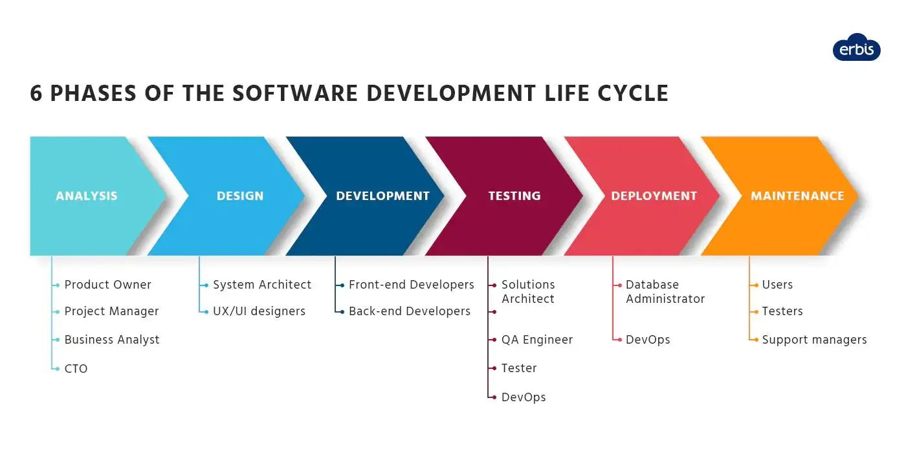
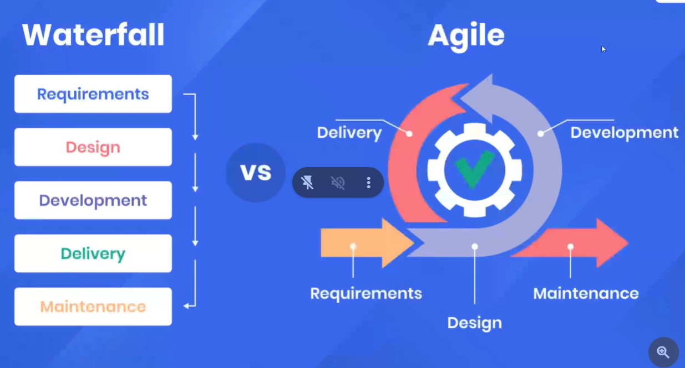
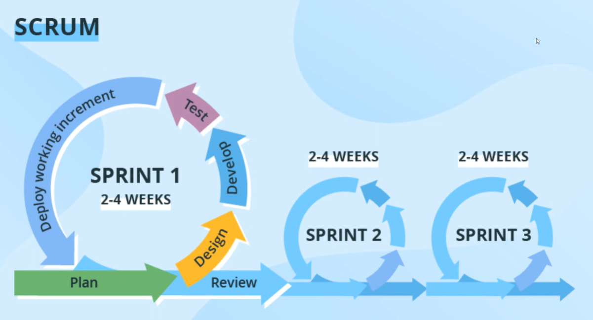

## SOFTWARE LIFE CYCLE

1. PLANNING
2. ANALYSIS
3. DESIGN
4. IMPLEMENTATION
5. TESTING & INTEGRATION
6. MAINTENANCE

## SDLC



## Waterfall model



Only in migration projects waterfall model is used in IT Industry.

## SCRUM



## Kanban Baord


**Note** : Burnout Graph is a graph that tells the performance of any individual in a project.

## CODING STANDARDS

Are meant to have unifromity throughout your code base.

## Variable names

- Understandable / Descriptive

```js
let a = 50; //wrong
let age = 50; //correct
```

- camelCase

```js
let student_name = "Srujan"; //wrong
let studentName = "Srujan"; // correct
```

### Errors(for variable name)

- Reserved keywords (`if`, `for`)

```js
let if="Srujan"; // wrong
```

- Cannot start with numbers

```js
let 2cool="Srujan"; // wrong
```

- Cannot be special symbols($,@,#,!)(except for `_`)

```js
let abc$123 = "Srujan"; // wrong
```

**Note** : Choose `let` over `var`,`const` over `let`

```js
let panCard = "########"; // wrong
const PANCARD = "########"; // correct
const marks = [10, 20, 30]; // correct
```

Write your `const` case

```js
const PiValue = 3.14; //wrong
const PI_VALUE = 3.14; //correct
```

## Documentation

- Single comment

```js
//
```

- Multiple comment

```js
/**
 *
 *
 *
 *
 * /
```
