1. Find the title of each film?

```sql
SELECT Title FROM movies;
```

2. Find the director of each film

```sql
SELECT Director FROM movies;
```

3. Find the title and director of each film

```sql
SELECT Title,Director FROM movies;
```

4. Find the title and year of each film

```sql
SELECT Title, Year FROM movies;
```

5. Find all the information about each film

```sql
SELECT * FROM movies;
```

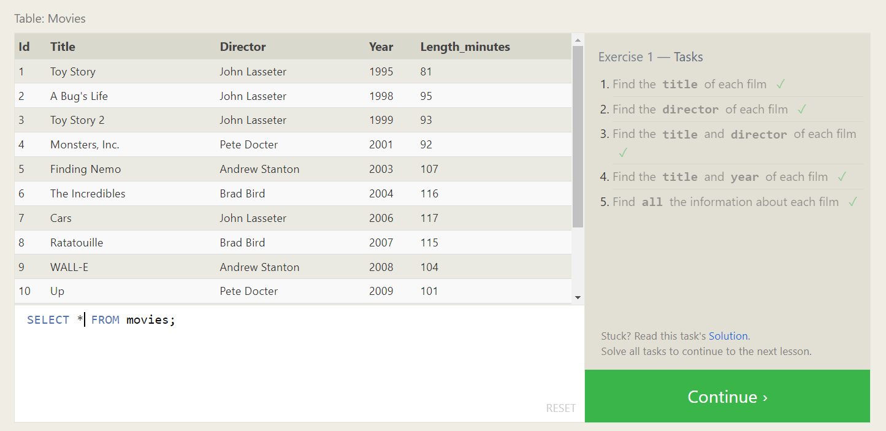

6. Find the movie with a row id of 6

```sql
SELECT *
FROM movies
WHERE Id=6;
```

7. Find the movies released in the years between 2000 and 2010

```sql
SELECT *
FROM movies
WHERE Year>=2000 AND YEAR<=2010;
```

8. Find the movies not released in the years between 2000 and 2010

```sql
SELECT *
FROM movies
WHERE Year NOT BETWEEN 2000 AND 2010;
```

9. Find the first 5 Pixar movies and their release year

```sql
SELECT *
FROM movies WHERE Year<=2003;
```

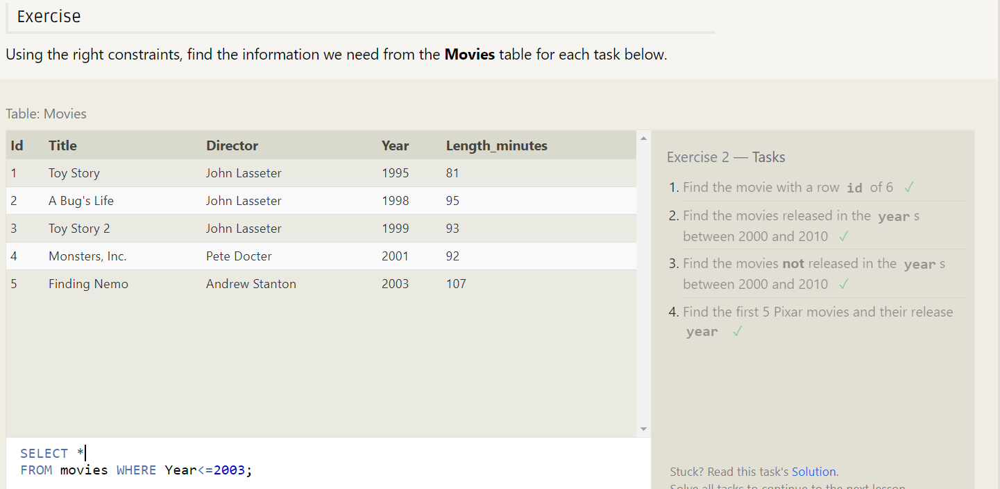

10. Find all the Toy Story movies

```sql
SELECT * FROM movies
WHERE Title LIKE "%Toy Story%";
```

11. Find all the movies directed by John Lasseter

```sql
SELECT * FROM movies
WHERE Director ="John Lasseter";
```

12. Find all the movies (and director) not directed by John Lasseter

```sql
SELECT * FROM movies
WHERE Director !="John Lasseter";
```

13. Find all the WALL-\* movies

```sql
SELECT * FROM movies WHERE Title LIKE "WALL-%";
```

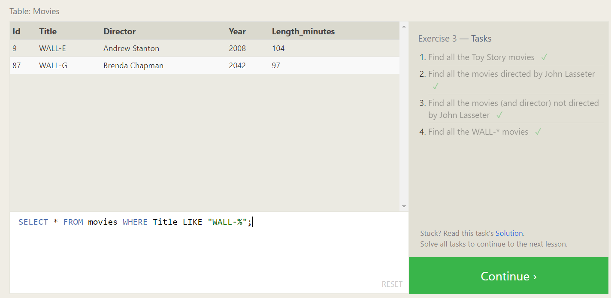

14. List all directors of Pixar movies (alphabetically), without duplicates

```sql
SELECT DISTINCT Director
FROM movies
ORDER BY Director;
```

15. List the last four Pixar movies released (ordered from most recent to least)

```sql
SELECT * FROM Movies ORDER BY Year DESC LIMIT 4;
```

16. List the first five Pixar movies sorted alphabetically

```sql
SELECT * FROM Movies ORDER BY Title LIMIT 5;
```

17. List the next five Pixar movies sorted alphabetically

```sql
SELECT * FROM Movies ORDER BY Title  LIMIT 5 OFFSET 5;
```

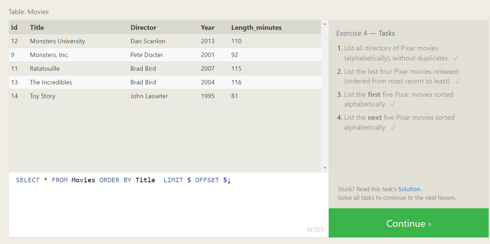

18. List all the Canadian cities and their populations

```sql
SELECT City, Population
FROM north_american_cities
WHERE Country LIKE "Canada";
```

19. Order all the cities in the United States by their latitude from north to south

```sql
SELECT City
FROM north_american_cities
WHERE Country LIKE "United States"
ORDER BY Latitude DESC;
```

20. List all the cities west of Chicago, ordered from west to east

```sql
SELECT City
FROM North_american_cities
WHERE Longitude < (SELECT Longitude
                    FROM North_american_cities
                    WHERE City="Chicago")
ORDER BY Longitude;
```

21. List the two largest cities in Mexico (by population)

```sql
SELECT City, Population
FROM north_american_cities
WHERE Country="Mexico"
ORDER BY Population DESC LIMIT 2;
```

22. List the third and fourth largest cities (by population) in the United States and their population

```sql
SELECT City, Population
FROM North_american_cities
WHERE Country="United States"
ORDER BY Population DESC
LIMIT 2 OFFSET 2;
```

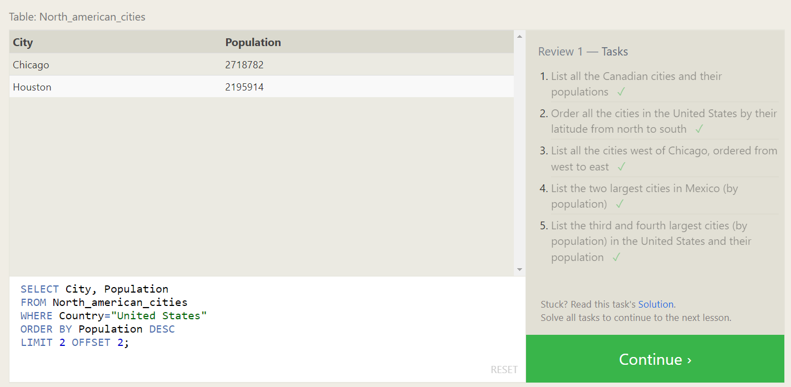

23. Find the domestic and international sales for each movie

```sql
SELECT * FROM Movies
INNER JOIN Boxoffice
ON Movies.Id=Boxoffice.Movie_Id;
```

24. Show the sales numbers for each movie that did better internationally rather than domestically

```sql
SELECT * FROM Movies
INNER JOIN Boxoffice
ON Movies.Id=Boxoffice.Movie_Id
WHERE International_sales > Domestic_sales ;
```

25. List all the movies by their ratings in descending order

```sql
SELECT * FROM Movies
INNER JOIN Boxoffice
ON Movies.Id=Boxoffice.Movie_Id
ORDER BY Rating DESC;
```

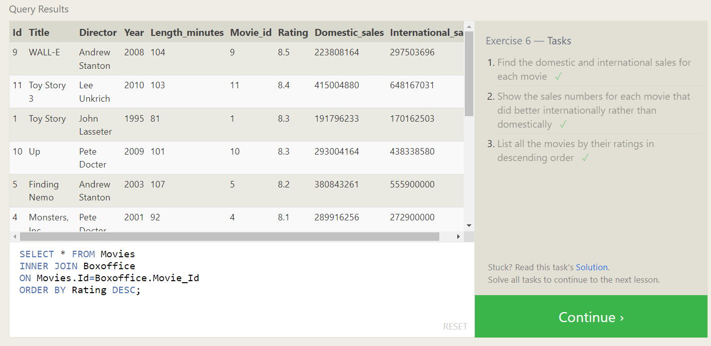

## KEYS

- **PRIMARY KEY**
  1. Unique
  2. Should not be null
  3. Only one column should be PK in a table.
- ***

### NORMALIZATION

- Main reason for Normalization is that it increases the safety of the data.

### 1NF


Convert this data into **1NF**
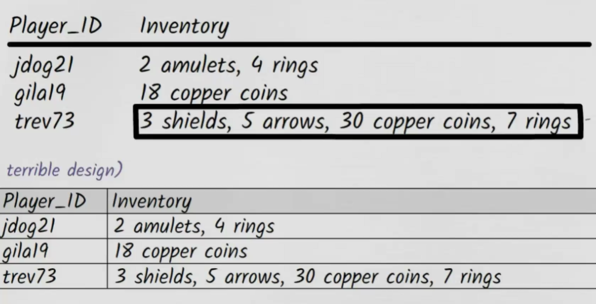
Solution
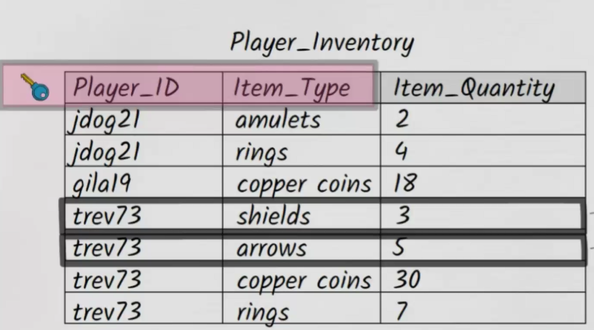
Example for 2NF
Question : What is the problem in this data table.

The problem is that this table contains updation anamoly. Due to repeatititve data in last column. So that should be removed using Normalization.

#### Solution

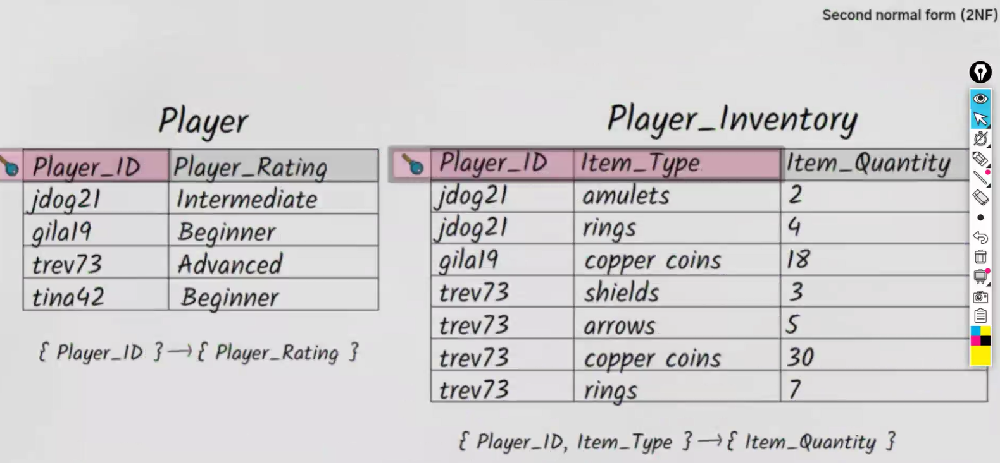
solution for optimizing

## JOINS


26. Find the list of all buildings that have employees

```sql
SELECT DISTINCT building FROM employees;
```

27. Find the list of all buildings and their capacity

```sql
SELECT * FROM Buildings;
```

28. List all buildings and the distinct employee roles in each building (including empty buildings)

```sql
SELECT DISTINCT Building_name,Role
FROM Buildings
LEFT JOIN Employees
ON Buildings.Building_name=Employees.Building;
```

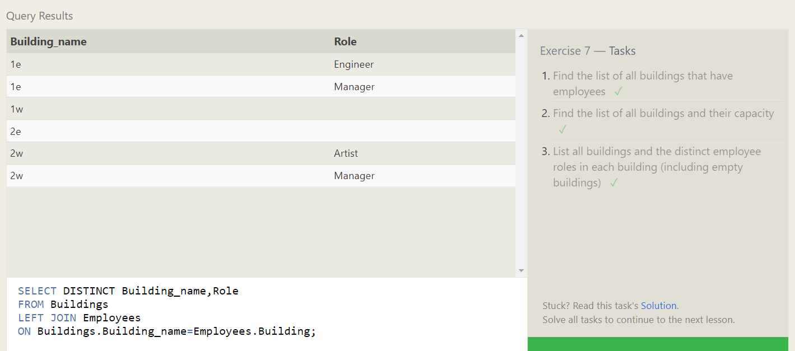

29. Find the name and role of all employees who have not been assigned to a building

```sql
SELECT Name,Role FROM employees
WHERE Building IS NULL;
```

30. Find the names of the buildings that hold no employees

```sql
SELECT DISTINCT Building_name
FROM Buildings
LEFT JOIN Employees
ON Buildings.Building_name=Employees.Building
WHERE BUILDING IS NULL;
```

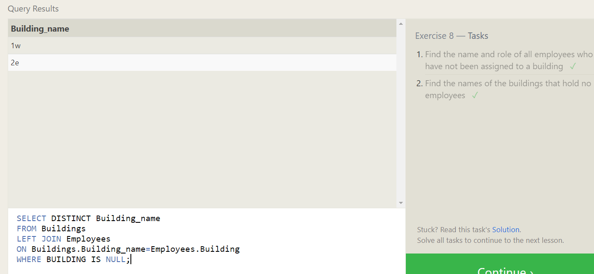

31. List all movies and their combined sales in millions of dollars

```sql
SELECT Title,(Domestic_sales + International_sales)/1000000 AS Combined_sales FROM Movies INNER JOIN Boxoffice ON Movie_id=id;
```

32. List all movies and their ratings in percent

```sql
SELECT Title, Rating*10 AS Percentage
FROM Movies INNER JOIN Boxoffice
ON Movie_id=id;
```

33. List all movies that were released on even number years

```sql
SELECT Title FROM Movies WHERE Year%2==0;
```

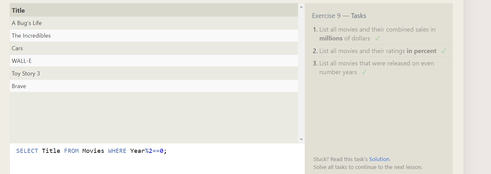

34. Find the longest time that an employee has been at the studio

```sql
SELECT MAX(Years_employed) FROM employees;
```

35. For each role, find the average number of years employed by employees in that role

```sql
SELECT Role,Avg(Years_employed)FROM employees
WHERE Years_employed GROUP BY Role;
```

36. Find the total number of employee years worked in each building

```sql
SELECT Distinct Building, SUM(Years_employed) from Employees
WHERE Years_employed GROUP BY Building;
```

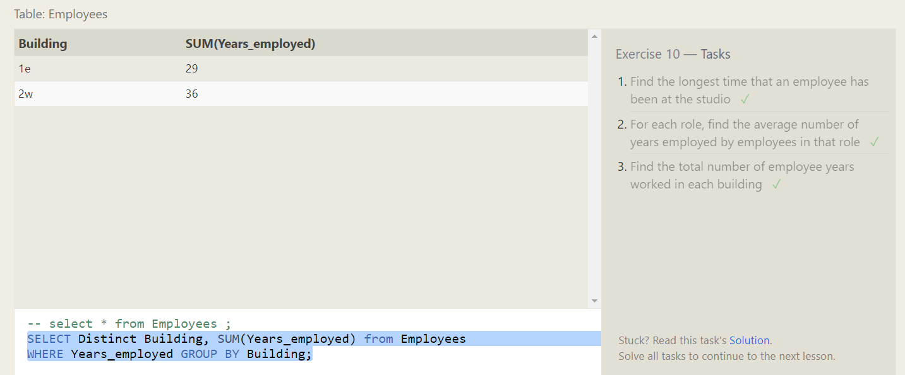
