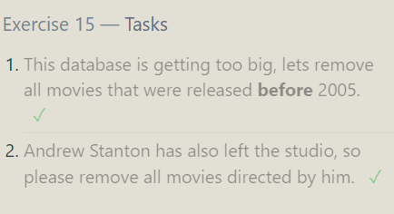

### 11 EXERCISE

1. Find the number of Artists in the studio (without a HAVING clause)

```sql
SELECT Count(Role)
FROM employees
WHERE Role="Artist" ;
```

**AGGREGATION** : It is used to visualize the large amount of data through aggregation functions. 2. Find the number of Employees of each role in the studio

```sql
SELECT Count(Role)
FROM Employees
GROUP BY Role;
```

3. Find the total number of years employed by all Engineers

```sql
SELECT SUM(Years_employed)
FROM Employees
WHERE Role="Engineer";
```


### 12 EXERCISE

1. Find the number of movies each director has directed

```sql
SELECT Director,Count(Title)
FROM movies
GROUP BY Director;
```

2. Find the total domestic and international sales that can be attributed to each director

```sql
SELECT Director, SUM(Domestic_sales)+SUM(International_sales)
FROM movies
INNER JOIN Boxoffice
ON id=movie_id
GROUP BY Director;
```


### 13 EXERCISE

1. Add the studio's new production, Toy Story 4 to the list of movies (you can use any director)

```sql
INSERT INTO Movies VALUES(4,"Toy Story 4","Srujan",2024,100);
```

2. Toy Story 4 has been released to critical acclaim! It had a rating of 8.7, and made 340 million domestically and 270 million internationally. Add the record to the BoxOffice table.

```sql
INSERT INTO Boxoffice VALUES(4,8.7,340000000,270000000);
```


### 14 EXERCISE

1. The director for A Bug's Life is incorrect, it was actually directed by John Lasseter

```sql
UPDATE Movies
SET Director = "John Lasseter"
WHERE Title="A Bug's Life";
```

2. The year that Toy Story 2 was released is incorrect, it was actually released in 1999

```sql
UPDATE Movies
SET Year = 1999
WHERE Title="Toy Story 2";
```

3. Both the title and director for Toy Story 8 is incorrect! The title should be "Toy Story 3" and it was directed by Lee Unkrich

```sql
UPDATE Movies
SET Title="Toy Story 3",Director="Lee Unkrich"
WHERE Title="Toy Story 8";
```


### 15 EXERCISE

1. This database is getting too big, lets remove all movies that were released before 2005.

```sql
DELETE FROM Movies
WHERE Year<2005;
```

2. Andrew Stanton has also left the studio, so please remove all movies directed by him.

```sql
DELETE FROM Movies
WHERE Director="Andrew Stanton";
```



### 16 EXERCISE

1. Create a new table named Database with the following columns:

- Name A string (text) describing the name of the database.
- Version A number (floating point) of the latest version of this database
- Download_count An integer count of the number of times this database was downloaded
- This table has no constraints.

```sql
CREATE TABLE Database(Name STRING,Version FLOAT,Download_count INTEGER);
```


### 17 EXERCISE

1. Add a column named Aspect_ratio with a FLOAT data type to store the aspect-ratio each movie was released in.

```sql
ALTER TABLE Movies
ADD Aspect_ratio FLOAT;
```

2. Add another column named Language with a TEXT data type to store the language that the movie was released in. Ensure that the default for this language is English.

```sql
ALTER TABLE Movies
ADD Language TEXT
DEFAULT English;
```


### 18 EXERCISE

1. We've sadly reached the end of our lessons, lets clean up by removing the Movies table

```sql
DROP TABLE IF EXISTS Movies;
```

2. And drop the BoxOffice table as well

```sql
DROP TABLE IF EXISTS Boxoffice;
```


